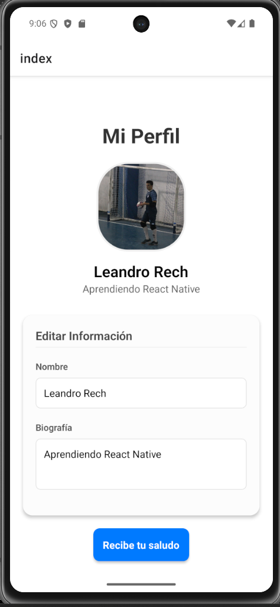
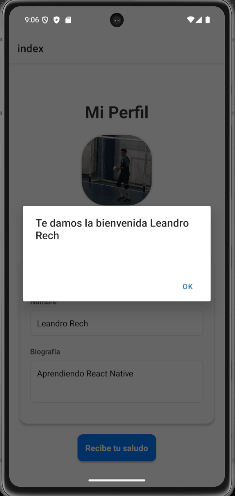

# Mobile Profile Interface - React Native 📱

A professional and interactive user profile screen developed as part of my **React Native** learning journey. This project focuses on **clean UI/UX**, **TypeScript** implementation, and **component modularization**.

## 🚀 Features

* **Dynamic Data:** Real-time updates of user information using `useState`.
* **Custom Components:** Features a standalone, reusable `Boton` (Button) component.
* **Android Optimized:** Specifically styled for Android using `elevation` and native interactions.
* **Type Safety:** Built 100% with **TypeScript** for robust code and fewer bugs.
* **UX Focused:** Includes `Keyboard.dismiss` on tap and interactive alerts.

## 🛠️ Tech Stack

* **Framework:** React Native (Expo)
* **Language:** TypeScript
* **Safe Area:** React Native Safe Area Context
* **Icons/Images:** External URI assets

## 📸 Preview

| Profile View | Edit Interaction |
| :--- | :--- |
|  |  |

## 🏁 How to Run

1. Clone this repository:
   ```bash
   git clone [https://github.com/your-username/your-repo-name.git](https://github.com/your-username/your-repo-name.git)